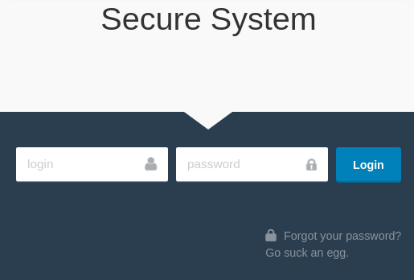
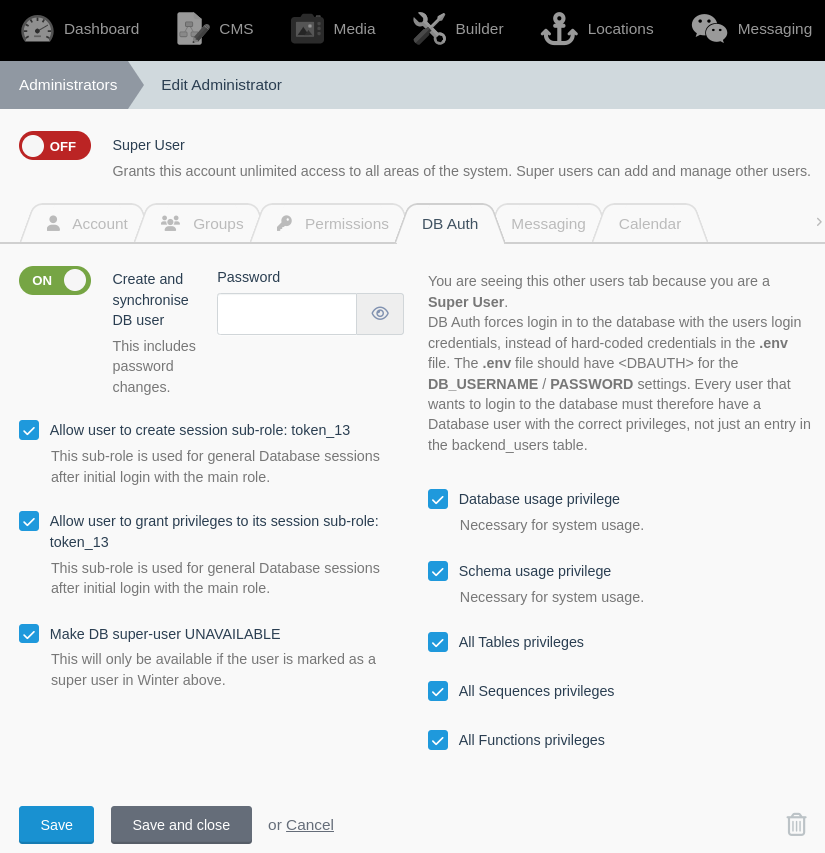

# DB Auth direct module
This module logs in to the database with the front-end user login credentials. Because of this no usernames/passwords are necessary on the webserver, in `config/database.php`.
After login Laravel creates a session token for further requests. At the same time this plugin creates a new database user with the same name as the session token and the same privileges as the original database user. Further database logins use this token database user. PostGreSQL RLS [Row Level Security](https://www.postgresql.org/docs/current/ddl-rowsecurity.html) policies are recommended to restrict access to information in the database.

DBAuth only officially supports PostGreSQL.

## Installation
`git clone` this module in to Laravel `~/modules`.
Register the `DBAuth\ServiceProvider::class` in the `config/app.php` providers list.
Set the database username and password in `config/database.app` to "&lt;DBAUTH&gt;" to trigger the plugin functionality.

## Login screen
DBAuth presents its own static HTML login screen because it needs to ensure that no attempts are made to access the database before login is successful. Laravels normal bootstrap and login screen process is likely to try and connect to the database. However, before DBAuth login, the database cannot be accessed. You can author your own version of the login screen by writing the `~/public/resources/login.html`.

## Artisan
Artisan also needs to connect to the database. It will attempt a standard development database login which is wise to use in development situations, and then ask if connection fails.

## Granting other users access
When a superuser creates a new user with [Winter CMS](https://wintercms.com), DBAuth will create a new PostGreSQL database user as well. This situation can be managed in the DBAuth account tab by super users.

