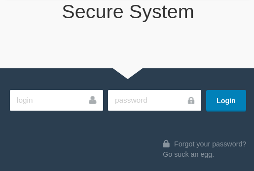
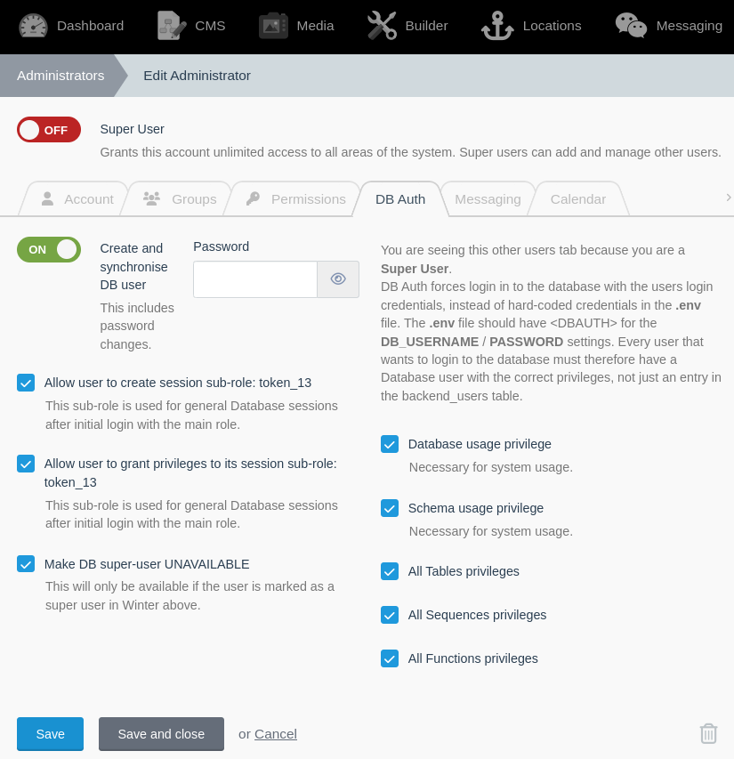

# DBAuth — Database-credential login for WinterCMS

[](https://github.com/anewholm/dbauth/actions/workflows/ci.yml) \(Currently being actively updated with a full PlayWright xdotool test-suite. Watch this space\)

> **Note:** CodeQL security scanning is unfortunately not available for PHP on GitHub's free tier.

DBAuth is a WinterCMS module that logs directly into PostgreSQL using the end-user's credentials. No database username or password is stored in `.env` or `config/database.php`. Each authenticated session is backed by a dedicated, short-lived PostgreSQL role, enabling [Row Level Security (RLS)](https://www.postgresql.org/docs/current/ddl-rowsecurity.html) policies to scope data access per user at the database level.



## What it does

1. Serves a static HTML login page before any database connection is attempted.
2. On successful login, creates a session-scoped PostgreSQL role with the same privileges as the authenticated user.
3. All subsequent Laravel database connections for that session use the session role.
4. On logout, the session role is revoked immediately.
5. When a WinterCMS admin creates a new backend user, DBAuth provisions a matching PostgreSQL role automatically.



## Why PostgreSQL only?

DBAuth is fundamentally built on PostgreSQL's `CREATEROLE`, `GRANT`, and Row Level Security features. MySQL has no equivalent. This is a deliberate architectural choice — the PostgreSQL security model is central to DBAuth's guarantees, not an incidental dependency.

**Requires PostgreSQL 12+. MySQL is not supported by design.**

## Compatibility

| WinterCMS | Laravel | PHP  | PostgreSQL |
|-----------|---------|------|------------|
| 1.2.0     | 9       | 8.1+ | 12+        |
| 1.2.x     | 10      | 8.1+ | 12+        |
| 1.2.x     | 11      | 8.2+ | 12+        |

## Prerequisites

- WinterCMS 1.2+ installed
- [Acorn module](https://github.com/anewholm/acorn) installed as `modules/acorn`
- PostgreSQL 12+ with a superuser account (needed during installation to create roles)

## Installation

1. Clone this repository into `modules/dbauth` inside your WinterCMS root:
   ```bash
   git clone https://github.com/anewholm/dbauth modules/dbauth
   ```

2. Clone the Acorn dependency into `modules/acorn`:
   ```bash
   git clone https://github.com/anewholm/acorn modules/acorn
   ```

3. Add both modules to `config/cms.php`:
   ```php
   'loadModules' => ['System', 'Backend', 'Cms', 'Acorn', 'DBAuth'],
   ```

4. Configure `.env` with your PostgreSQL superuser credentials and run migrations:
   ```ini
   DB_CONNECTION=pgsql
   DB_HOST=127.0.0.1
   DB_PORT=5432
   DB_DATABASE=your_database
   DB_USERNAME=your_superuser
   DB_PASSWORD=your_password
   ```
   ```bash
   php artisan winter:up
   ```
   This creates the necessary PostgreSQL roles and grants. The superuser is only needed during this phase.

5. Switch `.env` to DBAuth mode — replace the credentials with the sentinel values:
   ```ini
   DB_USERNAME=<DBAUTH>
   DB_PASSWORD=<DBAUTH>

   # Optional: for artisan/CLI access after switching to DBAuth mode
   # ARTISAN_AUTO_LOGIN=1
   # ARTISAN_DEV_PASSWORD=your_dev_password

   # Optional: for unauthenticated front-end requests
   # DBAUTH_FRONTEND_USER=frontend
   # DBAUTH_FRONTEND_PASSWORD=your_frontend_password
   ```

6. Navigate to `/backend/signin` — the DBAuth login screen will appear.

> **Note:** `ARTISAN_DEV_PASSWORD` and `DBAUTH_FRONTEND_PASSWORD` are development/infrastructure credentials, not end-user credentials. They do not replace the security model — DBAuth still creates session-scoped PostgreSQL roles per login and revokes them on logout.

## Custom login page

DBAuth serves its own static HTML login page to ensure no database connection is attempted before authentication. To customise it, create `public/resources/login.html`.

## Artisan

When `DB_USERNAME=<DBAUTH>`, DBAuth intercepts Artisan's database connection and prompts for credentials interactively. For automated `artisan` use (e.g. CI, cron), set these `.env` variables:

| Variable | Purpose |
|---|---|
| `ARTISAN_AUTO_LOGIN=1` | Skip the interactive prompt |
| `ARTISAN_DEV_PASSWORD` | Password used when auto-login is active |

## Frontend requests

Unauthenticated front-end page requests use a static PostgreSQL user with limited privileges (read access + write access to throttling tables). Configure this user in `.env`:

| Variable | Default | Purpose |
|---|---|---|
| `DBAUTH_FRONTEND_USER` | `frontend` | PostgreSQL username for unauthenticated requests |
| `DBAUTH_FRONTEND_PASSWORD` | *(empty)* | Password for the frontend user |

Create the PostgreSQL user with appropriate grants before switching `.env` to `<DBAUTH>` mode.

## Known limitations

- PostgreSQL only — no MySQL support.
- WinterCMS backend usernames cannot be changed after creation (WinterCMS limitation).
- Concurrent logins by the same user each receive their own session role; orphaned roles from crashed sessions are cleaned up on the next successful login.

## License

MIT
